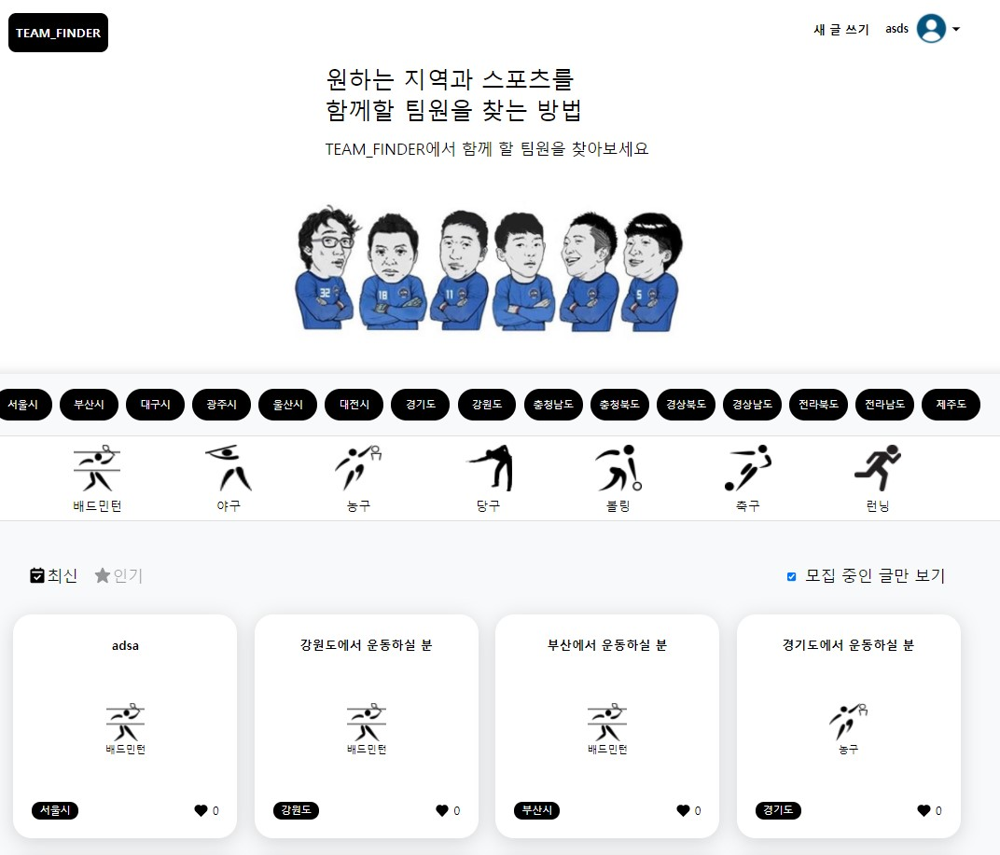
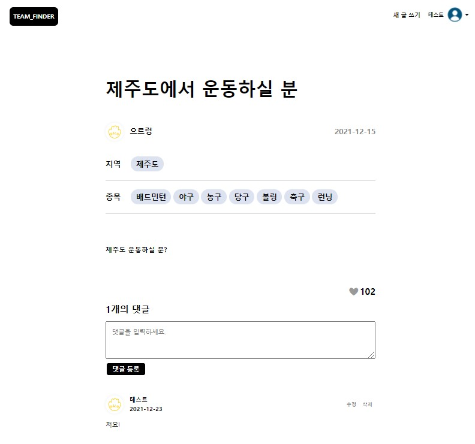
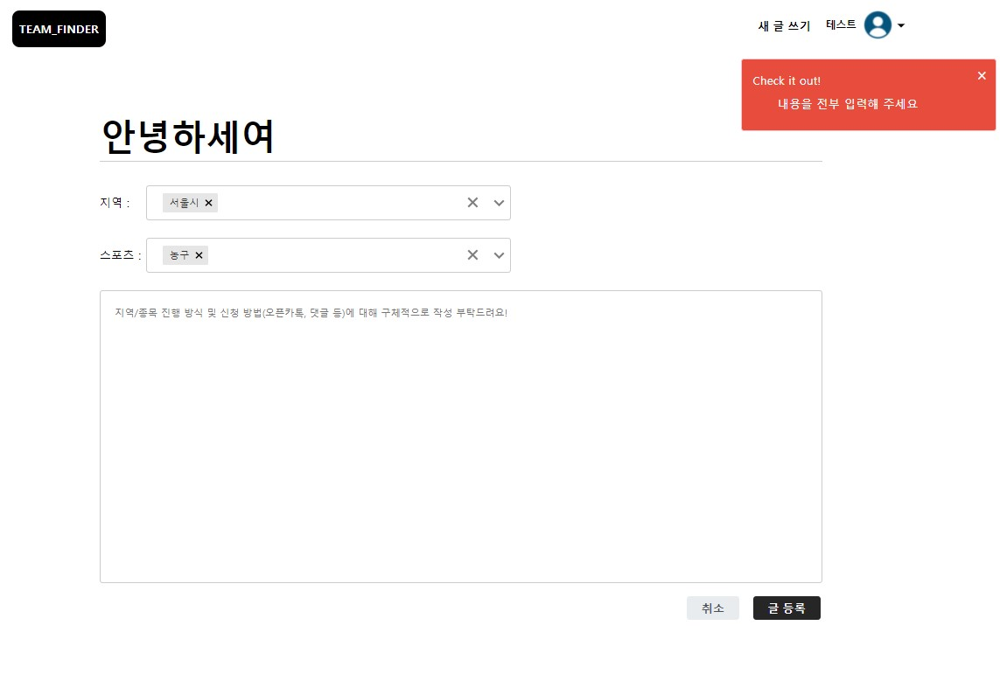
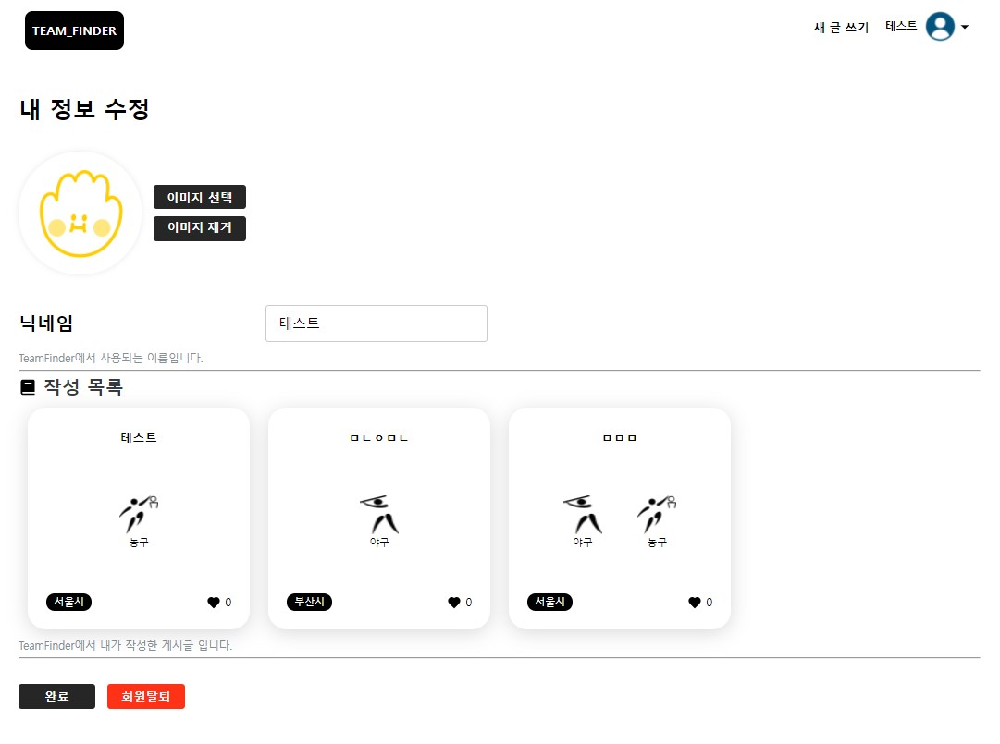

# TeamFinder - JavaScript

## 프로젝트 소개 
- 전국 스포츠 팀 모집 서비스
- 기간 : 2021/12/13 ~ 2021/12/23


## 실행 방법
```
① 해당 레포지토리를 클론한다.
② 프로젝트의 패키지를 설치한다. (npm install)
④ scripts 명령어로 프로젝트를 실행한다. (npm start)
```

## 기술 스택


## Trouble Shooting

  - 중복 이벤트 처리 - 글 작성 페이지 개발 중 사용자가 지역 / 스포츠 팀원을 선택하거나 선택한 목록들을 제거하는 비슷한 이벤트 처리 로직들을 처리할 때 이벤트를 중복적으로 선택하기보다는 e.target 으로 이벤트 위임을 통해 이벤트를 제어하였습니다. 하지만 e.target.parentNode.parentNode 처럼 해당 노드가 무엇을 가리키는지 코드만 보고는 짐작할 수 없게 되었습니다. 그래서 각각 요소의 이벤트를 직접 달아 줘야 할지 고민을 하였지만, 코드가 중복되고, 이벤트 호출을 과도하게 하는 부분 또한 성능적으로 부적절하다고 판단하였습니다. 해결 방법을 탐색하다 closest 메소드를 알게 되어 부모요소를 명시적으로 작성할 수 있게 되어 해결하였습니다.

  - Axios 라이브러리 도입 - 사용자의 Interaction 을 통해 서버와의 통신이 빈번하게 발생해 fetch 함수로 HTTP 응답을 보내거나 응답을 받았지만 BaseUrl 설정, 예외처리, JSON 데이터 변환 등의 불편한 점이 많아 프로젝트 중간에 Axios 로 변경하였습니다. Axios 를 사용하면
구형 브라우저 지원, 응답시간 초과 설정, 400, 500 대의 Error 발생 시 reject 로 오류 데이터를 전달하기 때문에 catch 로 잡아낼 수 있는 장점들이 있었습니다. 프로젝트 규모나 기간이 비교적 짧아 응답시간 초과설정이나, 네트워크 오류 등에 기능을 사용해 예외들을
세세하게 처리하진 못했지만 추후 프로젝트를 생각해 fetch 와 axios 둘 다 사용해 보았습니다.

## 프로젝트를 통해 알게 된 점 
  - 팀 프로젝트를 진행하면서 팀원들의 코드를 꼼꼼히 읽는 게 결국 나의 개발시간을 단축할 수 있다는 것을 알게 되었습니다. 프로젝트를 진행하다 보면 본인의 기능 개발의 초점을 맞추어 다른 팀원의 PR 을 제대로 확인하지 않고 대충 읽고 넘어가는 경향이 있었습니다.
그러다 보니 같은 역할을 하는 함수들을 팀원도 만들게 되고 저 또한 중복적으로 코드를 작성하게 되었습니다. 
이런 중복 함수들은 Utill 폴더로 전역에서 사용할 수 있도록 관리하는 게 프로젝트 기간을 효율적으로 줄일 수 있다는 것을 알게 되었고, 팀원들의 코드를 자세히 들여다보는 계기가 되었습니다


## 메인 페이지 


## 상세 페이지


## 글 작성 페이지


## 설정 페이지


